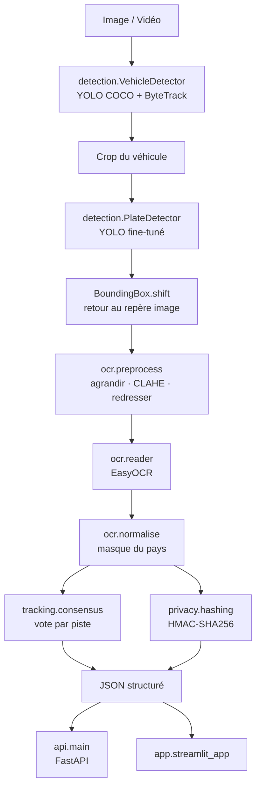

# ANPR Pipeline

Reconnaissance automatique de plaques d'immatriculation, structurée **en cascade** : le système
détecte d'abord les véhicules et leur type, cherche la plaque **dans la région du véhicule
seulement**, puis la lit. La sortie est un JSON associant à chaque véhicule son type, sa plaque
et les scores de confiance — directement exploitable par une base de données, un tableau de bord
ou un système d'alerte.

```
Image / Vidéo → Véhicule + type → Plaque (dans la ROI) → OCR → JSON structuré
```

---

## Pourquoi une cascade

L'approche naïve cherche la plaque directement dans l'image entière. La cascade restreint la
recherche à la boîte d'un véhicule déjà détecté.

**Ce que la cascade apporte, vérifié par la mesure :**

- **Association gratuite** — chaque plaque est rattachée au véhicule qui la porte, sans étape de
  mise en correspondance. Une détection directe ne dit pas *à quel* véhicule appartient la plaque.
- **Métadonnée en prime** — le type de véhicule accompagne la plaque dans la sortie JSON, ce qui
  est exactement le format qu'attend un système de péage ou de contrôle d'accès.

**Ce qu'elle apporte beaucoup moins qu'annoncé.** L'argument habituel est qu'elle réduirait
massivement les faux positifs — panneaux, affiches, reflets. `scripts/evaluate.py` mesure cette
hypothèse : sur les scènes du jeu de test, la détection directe trouve **les mêmes 17 plaques**
que la cascade, dont seulement **2 hors de tout véhicule — 11,8 %**.

L'effet est donc réel mais modeste. L'explication est logique après coup : l'argument vaut contre
un détecteur *générique* qui chercherait « un rectangle contenant du texte ». Ici le détecteur est
entraîné spécifiquement sur des plaques, il ne se déclenche pas sur un panneau — il reste peu de
faux positifs à éliminer.

Le coût de la cascade reste une passe d'inférence supplémentaire, chiffrée par
`scripts/benchmark_latency.py`. Le choix se justifie donc par l'association et la métadonnée, pas
par une précision qui n'a pas été observée.

---

## Ce que le projet fait

| Étage | Modèle | Entraînement |
|---|---|---|
| **1. Véhicule + type** | YOLOv8 sur COCO (`car`, `truck`, `bus`, `motorcycle`) | aucun — ces classes existent déjà |
| **2. Plaque dans la ROI** | YOLOv8n **fine-tuné** | **obligatoire** — aucun jeu de classes standard ne connaît « plaque » |
| **3. Lecture** | EasyOCR + redressement, CLAHE, agrandissement | aucun |
| **4. Vidéo** | ByteTrack + vote de consensus par piste | aucun |
| **5. Production** | FastAPI · Streamlit · MLflow · Dockerfile | — |

Plus, côté conformité et mesure :

- **Pseudonymisation HMAC** des plaques et **floutage des visages**
- **Benchmark de latence** par étage
- **Correction d'ambiguïtés pilotée par le format du pays**

---

## Les deux idées qui font la différence

### 1. La correction OCR est guidée par le masque du pays

Un OCR confond systématiquement `0`/`O`, `1`/`I`, `5`/`S`, `8`/`B`. Les corriger sans contexte
est impossible : remplacer tous les `0` par des `O` casse les plaques dont le chiffre est
légitime.

Le contexte utilisé ici est le **format attendu**. Une plaque française depuis 2009 s'écrit
`AA-123-AA`, soit le masque `LLDDDLL`. La correction devient alors déterministe, et surtout
**directionnelle** : le même caractère est corrigé dans un sens ou dans l'autre selon sa position.

```
Lecture brute :  0 8 1 O 5 C 1
Masque FR-SIV :  L L D D D L L
Résultat      :  O B 1 0 5 C I
                 ↑ ↑     ↑   ↑
                 chiffre→lettre    lettre→chiffre
```

Aucune règle globale ne peut produire ces deux corrections opposées simultanément.

Le module essaie chaque format déclaré et retient celui qui valide **en exigeant le moins de
corrections**. Entre deux formats valides, celui qui respecte le mieux la lecture brute gagne.

> **Déclarer le pays n'est pas cosmétique.** Plusieurs pays partagent une longueur de plaque.
> La lecture `081O5C1` valide en `08105C1` au format marocain avec **une** correction, contre
> **quatre** pour lire `OB105CI` en français. Les deux réponses sont défendables ; c'est le
> déploiement qui tranche, en déclarant son pays dans `configs/default.yaml`.

### 2. Le vote de consensus fiabilise la lecture sur vidéo

Un véhicule reste visible des dizaines de frames et sa plaque est lue autant de fois, avec des
résultats qui divergent. Retenir la dernière lecture serait arbitraire ; les réémettre toutes
noierait le consommateur sous les doublons.

Le voteur agrège les lectures **par piste** et élit une réponse pondérée par la confiance, avec
un bonus pour les lectures conformes à un format connu. Trois lectures moyennes concordantes
l'emportent sur une lecture isolée très sûre — c'est voulu : la concordance est un signal plus
fiable que la confiance affichée par un OCR, mal calibrée sur du texte court.

Chaque piste n'est émise **qu'une fois**, ce qui répond directement à l'exigence « éviter de
relire la même plaque en boucle ».

---

## Architecture



### Convention de coordonnées

L'étage plaque travaille sur un **crop** du véhicule, donc dans un repère local. Ses boîtes sont
ramenées au repère de l'image entière (`BoundingBox.shift`) **avant de quitter le module**, une
fois pour toutes. Le reste du pipeline n'a jamais à se demander de quel crop provient quelle
détection — c'est la source d'erreur classique de ce type d'architecture.

---

## Tech Stack

| Composant | Outil |
|---|---|
| Détection véhicule et plaque | Ultralytics YOLOv8 |
| Suivi vidéo | ByteTrack (intégré à Ultralytics) |
| OCR | EasyOCR |
| Traitement d'image | OpenCV |
| API | FastAPI + Uvicorn |
| Interface de démo | Streamlit |
| Suivi d'expériences | MLflow (backend SQLite) |
| Conteneurisation | Docker / docker-compose *(non testé — voir Limites)* |
| Tests | pytest |

---

## Project Structure

```
anpr-pipeline/
├── src/anpr/
│   ├── types.py              # BoundingBox, VehicleDetection, PlateReading, VehicleRecord
│   ├── config.py             # YAML + surcharges par variables d'environnement
│   ├── detection/
│   │   ├── vehicles.py       # étage 1 — classes COCO, aucun entraînement
│   │   └── plates.py         # étage 2 — recherche dans la ROI du véhicule
│   ├── ocr/
│   │   ├── preprocess.py     # agrandissement, CLAHE, redressement
│   │   ├── reader.py         # EasyOCR, lecture de plusieurs variantes
│   │   └── normalise.py      # masques de pays, correction d'ambiguïtés
│   ├── tracking/consensus.py # vote pondéré par piste
│   ├── privacy/
│   │   ├── hashing.py        # HMAC-SHA256 (stdlib seule)
│   │   └── anonymise.py      # floutage visages et plaques
│   ├── pipeline.py           # orchestration + chronométrage par étage
│   └── api/main.py           # FastAPI
├── app/streamlit_app.py
├── scripts/
│   ├── download_dataset.py   # téléchargement + conversion COCO → YOLO
│   ├── train_plate_detector.py
│   ├── evaluate.py
│   └── benchmark_latency.py
├── configs/default.yaml
└── tests/                    # 80 tests
```

---

## Installation

```bash
git clone https://github.com/ccna123456789/anpr-pipeline.git
cd anpr-pipeline
python -m venv .venv
.venv\Scripts\activate
pip install torch torchvision --index-url https://download.pytorch.org/whl/cpu
pip install -e ".[api,demo,mlops,dev]"
```

Sur Linux/macOS : `source .venv/bin/activate`. Le premier `pip install` force la variante CPU de
PyTorch ; sans lui, pip télécharge la variante CUDA (plusieurs Go inutiles sans GPU).

## Configuration

```bash
cp .env.example .env
python -c "import secrets; print(secrets.token_hex(32))"   # à coller dans ANPR_HASH_KEY
```

`ANPR_HASH_KEY` n'a **volontairement aucune valeur par défaut** : un secret écrit en dur dans le
code n'est pas un secret. Sans clé, le hachage lève une erreur explicite plutôt que de produire
une empreinte prévisible.

Le reste se règle dans `configs/default.yaml`, chaque clé étant surchargeable par
`ANPR_<NOM>` — la façon habituelle de configurer un conteneur sans reconstruire son image.

## Usage

**1. Récupérer le dataset et entraîner le détecteur de plaques** (une fois) :

```bash
python scripts/download_dataset.py
python scripts/train_plate_detector.py --data data/datasets/plates/data_fast.yaml \
    --imgsz 320 --batch 16 --fraction 0.25 --epochs 15 --cache
```

**2. Lancer l'API :**

```bash
uvicorn anpr.api.main:app --reload
```

```bash
curl -F "file=@voiture.jpg" http://localhost:8000/v1/analyse/image
```

**3. Ou l'interface de démonstration :**

```bash
streamlit run app/streamlit_app.py
```

**4. Mesurer :**

```bash
python scripts/evaluate.py
python scripts/benchmark_latency.py --images data/datasets/plates/test/images
```

## Example

Réponse de `POST /v1/analyse/image` :

```json
{
  "frame": 0,
  "vehicles_detected": 2,
  "plates_read": 1,
  "timings_ms": { "vehicle_detection": 84.2, "plate_detection": 41.6, "ocr": 310.7 },
  "results": [
    {
      "vehicle": { "type": "car", "label": "voiture", "confidence": 0.91,
                   "box": [412.0, 268.5, 903.1, 612.4] },
      "track_id": null,
      "plate": {
        "box": [598.2, 520.1, 712.8, 551.0],
        "detection_confidence": 0.78,
        "text": "AB123CD",
        "raw": "A8123CD",
        "ocr_confidence": 0.64,
        "format": "FR-SIV"
      }
    }
  ]
}
```

`raw` conserve la sortie brute de l'OCR et `text` la version normalisée. Garder les deux permet
de savoir si une erreur vient de la lecture ou de la normalisation — distinction impossible si
l'on écrase la sortie brute.

Avec `?store=true`, le texte en clair disparaît au profit de son empreinte HMAC : c'est le mode
à utiliser pour tout stockage durable.

---

## Results

Toutes les mesures ci-dessous proviennent des scripts du dépôt, sur processeur (8 cœurs, pas de
GPU). Aucune n'est reprise d'ailleurs.

### Détecteur de plaques

Entraîné avec `scripts/train_plate_detector.py` : `yolov8n`, 320 px, **25 % du jeu
d'entraînement** (1 544 images), 6 époques, meilleur checkpoint à l'époque 5.

| Époque | Précision | Rappel | mAP50 | mAP50-95 |
|---|---|---|---|---|
| 1 | 0,904 | 0,508 | 0,730 | 0,402 |
| 2 | 0,868 | 0,749 | 0,843 | 0,434 |
| 3 | 0,892 | 0,815 | 0,896 | 0,499 |
| 4 | 0,888 | 0,802 | 0,887 | 0,460 |
| **5** | **0,933** | **0,837** | **0,900** | 0,483 |
| 6 | 0,910 | 0,870 | 0,876 | 0,488 |

Le gain s'arrête dès l'époque 3 : l'entraînement a été interrompu là plutôt que de consommer une
heure de calcul pour un gain marginal.

**Sur le split de test complet — 882 images jamais vues :**

| Métrique | Valeur |
|---|---|
| mAP50 | **0,904** |
| mAP50-95 | 0,488 |
| Précision | 0,928 |
| Rappel | 0,815 |
| Inférence | 33,6 ms/image |

Un mAP50-95 de 0,49 face à un mAP50 de 0,90 indique que le modèle **trouve** bien les plaques mais
les cadre approximativement. Pour un OCR qui rogne avec 15 % de marge, la localisation grossière
suffit ; pour une mesure de position, non.

### Pipeline complet — 120 images du split de test

Le jeu de test est **hétérogène**, ce que l'évaluation rapporte explicitement :

| Composition | |
|---|---|
| Scènes de rue avec véhicule | 26 |
| Gros plans de plaque sans véhicule | 94 |

La cascade est par construction inévaluable sur les gros plans — il n'y a pas de véhicule à
recadrer. Les chiffres suivants ne portent donc que sur les 26 scènes.

| Cascade contre détection directe | |
|---|---|
| Véhicules détectés | 47 |
| Plaques via cascade | 17 |
| Plaques via détection directe | 17 |
| **Dont hors de tout véhicule** | **2 (11,8 %)** |

La cascade écarte donc **11,8 %** des détections directes, celles qui ne correspondent à aucun
véhicule. C'est réel mais modeste — bien loin de la réduction massive habituellement annoncée,
pour la raison expliquée plus haut.

| Lecture | |
|---|---|
| Taux de lecture | **88,2 %** des plaques détectées |
| Dont format pays reconnu | 20,0 % |

Le taux de 20 % s'explique par le dataset : il est international, alors que la configuration
force le format français. Ce n'est pas un défaut du normaliseur mais l'effet attendu d'une
contrainte de pays appliquée à des plaques étrangères.

### Latence — le coût réel de chaque étage

Médiane sur 10 images × 3 répétitions, itération de chauffe écartée.

| Configuration | Véhicule | Plaque | OCR | **Total** | Débit |
|---|---|---|---|---|---|
| Cascade + OCR multi-variantes | 181 ms | 171 ms | **1 877 ms** | 2 054 ms | 0,49 img/s |
| Cascade + OCR variante unique | 179 ms | 168 ms | 664 ms | 941 ms | 1,06 img/s |
| Détection seule, sans OCR | 175 ms | 173 ms | — | 350 ms | 2,86 img/s |

**L'OCR représente 91 % du temps total.** Les deux étages de détection ne coûtent ensemble que
350 ms — optimiser la détection ne servirait donc quasiment à rien tant que l'OCR n'est pas
traité. C'est le genre de conclusion qu'un benchmark par étage donne immédiatement et qu'une
mesure globale masquerait.

Le choix de lire plusieurs prétraitements **triple** le coût de l'OCR (664 → 1 877 ms). Le
réglage `ocr_variants` permet d'arbitrer explicitement entre fiabilité et débit.

### Tests

```
110 passed
```

---

## Conformité RGPD

Une plaque d'immatriculation est une **donnée à caractère personnel** : elle identifie
indirectement une personne physique. Un système qui journalise des plaques en clair constitue un
fichier de données personnelles.

**Pourquoi HMAC et non un simple SHA-256.** L'espace des plaques est minuscule — quelques
centaines de millions de combinaisons. Un SHA-256 nu se casse par force brute en quelques
minutes : il suffit de hacher toutes les plaques possibles et de comparer. Le HMAC introduit une
clé secrète propre au déploiement, sans laquelle cette attaque est impossible. C'est la
différence entre une donnée réellement pseudonymisée et une donnée qui n'est protégée qu'en
apparence.

L'empreinte reste **comparable** : on peut vérifier qu'un véhicule déjà vu repasse, ce qui suffit
au contrôle d'accès, au comptage de véhicules uniques ou à la détection de récidive.

Le floutage des visages utilise le classifieur de Haar livré avec OpenCV — aucun téléchargement,
quelques millisecondes, et un faux positif y est sans conséquence.

---

## Limites connues

- **Docker n'a pas été testé.** Le `Dockerfile` et le `docker-compose.yml` sont fournis parce
  qu'ils font partie du cahier des charges et documentent les dépendances système réelles, mais
  Docker n'était pas installé sur la machine de développement. Ils doivent être considérés comme
  non validés tant qu'un `docker build` n'a pas abouti.
- **L'exactitude de l'OCR n'est pas mesurée.** Le dataset annote la *position* des plaques, pas
  leur *texte*. Le taux de lecture rapporté mesure la production d'une chaîne plausible, pas sa
  justesse. Le mesurer demanderait un jeu de données annoté en texte.
- **Le détecteur de plaques est volontairement sous-entraîné.** Faute de GPU, il n'a vu que 25 %
  du jeu d'entraînement, en 320 px, sur 6 époques. Son mAP50 de 0,904 est honorable mais son
  mAP50-95 de 0,488 montre qu'il cadre approximativement. Les métriques publiées sont celles de
  ce modèle, pas de ce que l'architecture permet.
- **Formats de plaques limités** à FR, ES, IT et MA. Le format marocain n'est couvert que par sa
  partie latine : la lettre arabe n'est pas lue par un OCR configuré en caractères latins.
- **La contrainte par pays est une arme à double tranchant.** Elle est indispensable en
  déploiement réel — un parking lyonnais ne doit pas tester le format marocain — mais elle
  produit des normalisations *confiantes et fausses* sur un jeu d'images internationales. Le
  dataset d'évaluation utilisé ici en contient : une plaque étrangère forcée au masque français
  `DDDDLLDD` ressort bien formée mais inexacte. Le champ `raw` de la sortie JSON existe
  précisément pour rendre ce cas détectable — comparer `raw` et `text` révèle immédiatement une
  normalisation abusive.
- **Inférence sur processeur** uniquement. Aucune optimisation ONNX ni quantization.
- **Pas de rapport de biais par condition** (nuit, pluie, angle). Le dataset n'étiquette pas les
  conditions de prise de vue, ce qui rendrait la mesure arbitraire.

## Future Improvements

- **Annoter le texte d'un échantillon de test** pour mesurer une exactitude d'OCR réelle, et non
  un simple taux de lecture.
- **Export ONNX et quantization**, avec comparaison avant/après dans le benchmark de latence.
- **Fusionner les deux détecteurs** en un modèle multi-classes une fois le pipeline stabilisé :
  une passe au lieu de deux, au prix de la modularité.
- **Étendre les formats de pays**, et gérer les plaques arabes avec un OCR multi-alphabet.
- **Worker de purge** appliquant une durée de rétention configurable aux empreintes stockées.

## Crédits

Dataset d'entraînement : *Vehicle Registration Plates*, Augmented Startups via Roboflow,
distribué sur Hugging Face sous licence **CC BY 4.0**. Il n'est pas redistribué dans ce dépôt —
voir [docs/DATA.md](docs/DATA.md).
